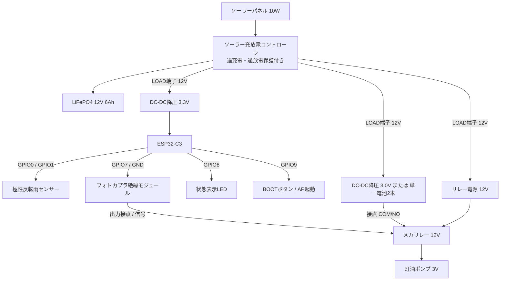

# LushGate (ラッシュゲート)

[English](README.md) | **日本語**

> 🚧 **ステータス: 開発中（仕掛り / ハードウェア部品発注中）**  
> 本リポジトリは現在、部品発注およびプロトタイプ製作段階の仕掛り状態です。ファームウェア設計・回路設計・Web UIの先行実装が完了しています。

---

ESP32-C3 を用いた山間部・露地畑向けの自律型自動散水システム。  
降雨の有無（累積時間）を自作の低消費電力・腐食防止雨センサーで判断し、フォトカプラ絶縁モジュール＋メカリレーで灯油ポンプを安全に制御して散水を行います。  
現場での設定・メンテナンス用に、**Wi-Fi APモード + mDNS (`lushgate.local`) + Web UI** を搭載し、スマートフォンのブラウザから1タップで時刻補正、スリープ・散水設定のNV保存、散水履歴の確認やCSV出力が可能です。

---

## 1. 主な機能・特徴

- **超低消費電力運用 (Deep Sleep)**:
  - 待機時はWi-Fi/Bluetoothを完全OFF。数分おきに復帰し数msのパルス測定で雨量を積算。
- **オンデマンド Wi-Fi AP & mDNS (`http://lushgate.local`)**:
  - ルーター不要。畑で `BOOTボタン` を長押しするだけで直接スマホから接続可能。
- **Webによる1タップ時刻補正 (RTC同期)**:
  - スマホのブラウザ時刻とワンタップでESP32内蔵RTCを同期。
- **Webによる動作・散水設定 (NVS保存)**:
  - 散水時刻、雨量スキップ閾値、雨監視スリープ間隔、ポンプデューティ駆動時間（ON/OFF/総時間）をWebから変更・NV（不揮発性メモリ）へ保存。
- **散水履歴のWeb参照 & CSV出力**:
  - 過去60回分の散水実績（日時、24h降雨積算、散水可否、実稼働時間）を一覧表示＆CSVダウンロード。
- **手動散水 & センサーテスト**:
  - 現場での配線確認用ポンプ手動駆動（安全タイマー付き）および雨センサーリアルタイム測定。

---

## 2. ハードウェア仕様 & I/O ピンアサイン

### マイコン: ESP32-C3 (3.3V Logic)

| GPIO | 機能名 | 入出力 / 属性 | 用途・接続先 |
|---|---|---|---|
| **GPIO0** | `RAIN_SENSE_A` | ADC1_CH0 / InOut | 雨センサー電極A（パルス駆動 / ADC測定） |
| **GPIO1** | `RAIN_SENSE_B` | ADC1_CH1 / InOut | 雨センサー電極B（パルス駆動 / ADC測定） |
| **GPIO7** | `PUMP_CTRL` | Digital Output | ポンプ駆動制御 (Active-High: フォトカプラ絶縁モジュール入力) |
| **GPIO8** | `STATUS_LED` | Digital Output | 動作状態インジケータLED (APモード時点滅) |
| **GPIO9** | `USER_BUTTON` | Digital Input (Pull-up) | BOOTボタン共用 (2秒長押しでWi-Fi AP起動) |
| **GPIO2-6, 10** | *(予備)* | GPIO / ADC1 | 予備・将来の拡張用（フロートスイッチ・水位センサ等） |
| **GPIO18/19**| `USB_D- / D+`| Native USB | ファームウェア書き込み・USBシリアルデバッグ |

---

## 3. 回路図 (Schematics)

### 全体ブロック図



---

### (1) 雨センサー回路（対称型・極性反転・腐食対策）

```
                +3.3V (内部High出力)
                  |
             [ GPIO0 (A) ]
                  |
                [ 1kΩ ] (保護抵抗)
                  |
     +------------+------------+
     |                         |
  [ 100kΩ ] (Rref)         [電極プレートA] (SUS製)
     |                         :
    GND                    (雨滴 R_rain)
                               :
                           [電極プレートB] (SUS製)
                               |
     +------------+------------+
     |                         |
  [ 100kΩ ] (Rref)           [ 1kΩ ] (保護抵抗)
     |                         |
    GND                   [ GPIO1 (B) ]
                               |
                              ADC入力
```

---

### (2) ポンプ駆動回路（フォトカプラ絶縁モジュール ＋ メカリレー）

```
[ ESP32 制御系 (3.3V給電) ]      [ フォトカプラ絶縁モジュール ]         [ リレー駆動系 (12V) ]
                                      +------------------+
ESP32 3.3V (給電) -----------------> | VCC (入力側3.3V)  |
GPIO7 (PUMP_CTRL 信号) ------------> | IN1+ (または IN1) |
ESP32 GND (信号GND) ----------------> | IN1- (または GND) |         +12V (コントローラ LOAD+)
                                      |                  |          |
                                      |     JD-VCC/出力VCC| <--------+
                                      |                  |          +-------------+
                                      |             OUT1 | -------------------> | / | (1N4007)
                                      |                  |        [ リレーコイル ] |/  | (逆起電力吸収)
                                      |         出力 GND | <---+  [ 12V メカリレー ]+---+
                                      +------------------+     |                  |
                                                               +------------------+
                                                               |
                                                           12V GND (コントローラ LOAD-)
```
※ フォトカプラ入力側（一次側）は **ESP32の3.3V電源およびGPIO7から給電・駆動** され、リレーコイル・モータ駆動側の12V/3V電源（二次側）とはGNDを含めて完全にガルバニック絶縁されます。

---

## 4. 運用モードとWeb操作ガイド

### 4.1 モード切り替え
- **通常運用モード (Normal Mode)**:
  - Deep Sleepで設定周期（デフォルト3分）ごとに起動し、雨センサーをチェック・積算。
  - 朝の設定時刻（デフォルト07:00）に24h累積降雨が閾値（デフォルト60分）未満の場合、ポンプを自動デューティ駆動（3分ON / 2分OFF、正味10分）。
  - 散水完了・スキップ結果をNVS履歴に保存後、Deep Sleepへ移行。
- **APメンテナンスモード (Web UI)**:
  - `BOOTボタン (GPIO9)` を **2秒間長押し** するとLEDが点滅し、SoftAPとmDNSが起動。
  - スマホで Wi-Fi SSID: `LushGate-XXXX` に接続後、ブラウザで **`http://lushgate.local`** (または `http://192.168.4.1`) にアクセス。
  - 5分間無操作（または画面上の「スリープへ」ボタン押下）で自動停止しDeep Sleepへ復帰。

### 4.2 Web UI 機能一覧
1. **ステータス & 時刻同期**:
   - ESP32内蔵RTCの現在時刻、本日累積雨量、雨センサー生ADC値・電圧、次回判定時刻を表示。
   - 「📱 スマホ時刻と同期」ボタンで1タップ補正。
2. **設定画面 (NV保存)**:
   - 散水時刻 (時:分)、雨監視周期 (分)、散水スキップ降雨閾値 (分)、雨滴判定ADC閾値 (mV)、ポンプON/OFF/総散水時間、APタイムアウトを変更してNVSへ即時保存。
3. **散水履歴**:
   - 過去60回分の散水実績（日時、降雨積算、散水可否、稼働秒数）を表示。
   - CSVファイルとして直接ダウンロード可能。
4. **手動テスト**:
   - 30秒間のポンプ試運転、即時停止、雨センサー即時測定。

---

## 5. Web REST API 仕様

| Method | URI | 説明 |
|---|---|---|
| `GET` | `/` | Web UI シングルページ (HTML/CSS/JS) |
| `GET` | `/api/status` | RTC時刻、雨量積算、センサ生値、設定値の取得 |
| `POST`| `/api/time` | 時刻同期 (`{"epoch": 1726904123}`) |
| `GET` | `/api/config` | 現在の設定値一覧取得 |
| `POST`| `/api/config` | 設定値の更新・NVS保存 |
| `GET` | `/api/history` | 散水履歴一覧 (JSON) |
| `GET` | `/api/history/csv` | 散水履歴のCSVダウンロード |
| `POST`| `/api/history/clear` | 散水履歴の全消去 |
| `POST`| `/api/pump/test` | ポンプ手動駆動 (`{"action":"start","duration_sec":30}`) |
| `POST`| `/api/system/sleep` | APモードを終了し即時Deep Sleepへ移行 |

---

## 6. ディレクトリ構成

```
LushGate/
├── README.md               # 英語版システム仕様書 & 取扱説明書
├── README.jp.md            # 日本語版システム仕様書 & 取扱説明書
├── LushGate_spec.md        # 原本仕様書
├── CMakeLists.txt          # ESP-IDF プロジェクトCMake
└── main/
    ├── CMakeLists.txt      # コンポーネントCMake & Webファイル埋め込み
    ├── main.c              # メイン制御フロー & Deep Sleep / スケジュール管理
    ├── lushgate_pins.h     # GPIOピンアサイン定義
    ├── rain_sensor.c/.h    # 極性反転・低消費電力雨センサードライバ
    ├── pump_control.c/.h   # ポンプデューティ駆動 & 手動テストドライバ
    ├── storage_manager.c/.h# NVS設定管理 & 履歴リングバッファ
    ├── wifi_ap.c/.h        # SoftAP & mDNS (lushgate.local) 起動管理
    ├── web_server.c/.h     # HTTPサーバー & RESTful API 実装
    └── web/
        └── index.html      # モダンWeb UI (SPA / HTML5+CSS+JS)
```

---

## 7. ビルド & 書き込み手順 (ESP-IDF)

```bash
# ターゲット設定 (ESP32-C3)
idf.py set-target esp32c3

# ビルド
idf.py build

# 書き込み & シリアルモニタ
idf.py -p /dev/ttyACM0 flash monitor
```
